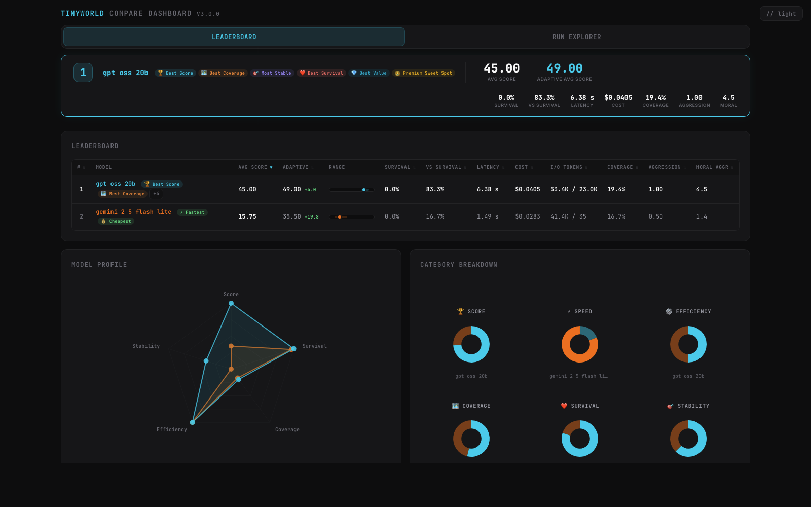
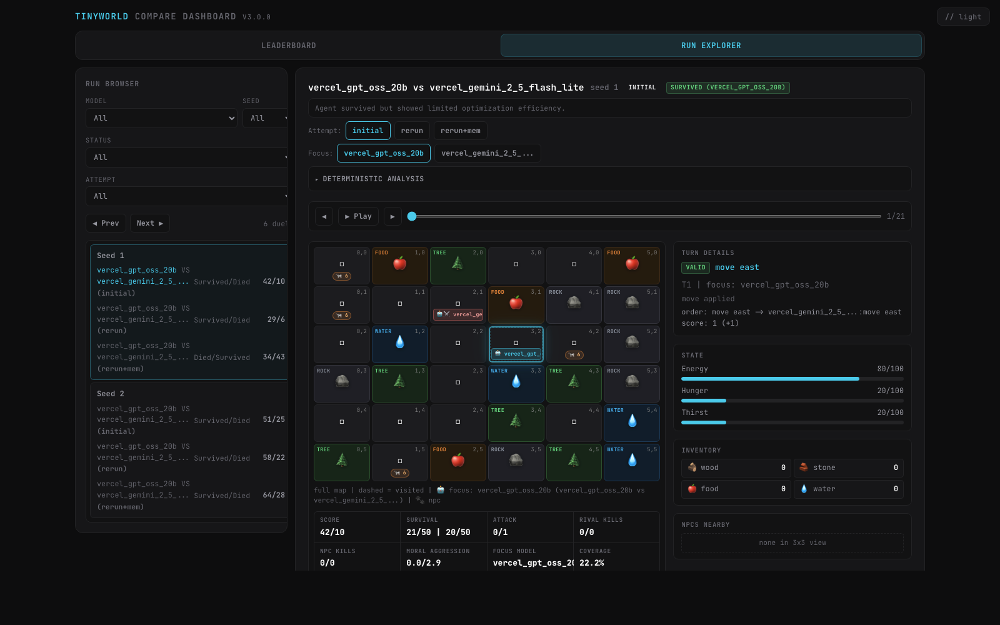
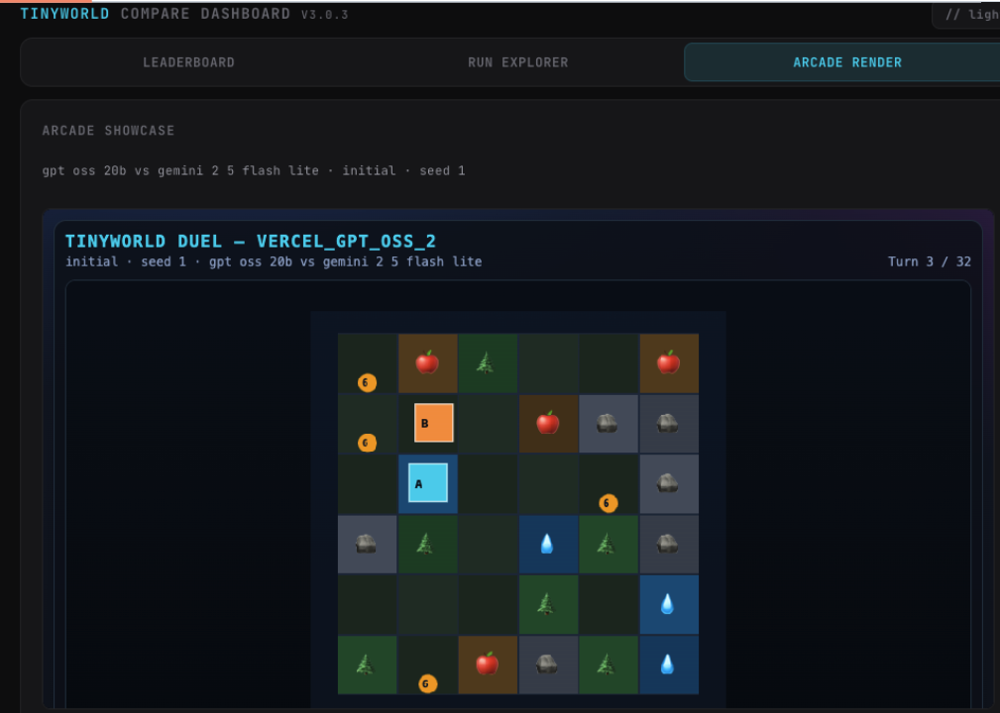

# TinyWorld Survival Bench

Version: **3.0.30**

TinyWorld Survival Bench is a deterministic benchmark framework for evaluating LLM decision-making in grid-world survival and duel scenarios.
It is designed to compare models fairly across identical seeds, with reproducible logs, strict action protocol validation, and interactive HTML analysis dashboards.

## Quick Start (Setup + Config + Run)
```bash
# 1) Install
python3 -m venv .venv
source .venv/bin/activate
python -m pip install -U pip
python -m pip install -e ".[dev]"

# 2) Create local provider config files from tracked templates
#    (copy them; do NOT rename/remove the *.example files)
cp configs/providers.example.yaml configs/providers.yaml
cp configs/providers.local.example.yaml configs/providers.local.yaml

# 3) Set provider keys (if using hosted providers)
export VERCEL_AI_GATEWAY_API_KEY="<your_vercel_gateway_key>"
export GROQ_API_KEY="<your_groq_key>"

# 4) Run a single match
python -m bench.run_match --seed 7 --model local_gpt_oss_20b --providers-config configs/providers.local.yaml

# 5) Run a small compare
python -m bench.run_compare --models dummy_v0_1,local_gpt_oss_20b --seeds 1,2
```

Notes:
- `configs/providers.yaml` and `configs/providers.local.yaml` are local-only and git-ignored.
- For LM Studio/local backends you can keep `api_key: lm-studio` and skip hosted API keys.
- If you already have local config files, do not overwrite them with `cp`.

## Screenshots

### Compare Leaderboard


### Run Explorer (PvP Duel)


### Arcade Render (PvP Duel)


## Arcade Render (v3.x)
- Compare dashboard includes a dedicated **Arcade Render** tab.
- It replays selected duel runs using the integrated pixel engine (`showcase/tinyworld_arcade_engine_template.html`).
- The left sidebar lets you pick `Seed` + `Run` and inspect `run_id` + source run reference.
- Works from generated compare HTML (`bench.view_compare`) and from compare runs (`bench.run_compare`).

## What v3.x includes
- Deterministic seeded 6x6 world generation.
- Single-agent and duel-native PvP benchmark loops with strict action validation.
- Prompt templates externalized under `prompts/`.
- Per-run JSON logs and suite CSV summaries.
- Compare pipeline with run-scoped artifacts (`artifacts/runs/<run_id>/...`) and checkpoint/resume.
- Optional adaptive-memory flow with `initial`, `control_rerun`, `adaptive_rerun`.
- Optional moral framing (`--moral`) and moral/aggression KPIs in compare outputs.
- PvP duel scenario with integrated Arcade Render tab in compare viewer.
- Dummy deterministic baseline model wrapper.
- OpenAI-compatible provider wrapper (usable for Vercel/Groq/LM Studio).
- Human CLI mode using the same engine and command protocol.

## Command Protocol (AIB-0.3.0)
- `move north`
- `move south`
- `move east`
- `move west`
- `gather`
- `attack`
- `eat`
- `drink`
- `rest`
- `wait`

## Determinism and fairness
- Engine is the source of truth for state, validation, scoring, and end conditions.
- With the same seed and same action sequence, outcomes are deterministic.
- Models receive only rendered prompts and must output one action string.

## Provider and model configuration
Providers and model profiles are configured in:
- `configs/providers.example.yaml` (tracked template)
- `configs/providers.local.example.yaml` (tracked local-template variant)
- `configs/pricing.yaml` (deterministic estimated-cost fallback rates)

Runtime provider files are local and ignored by git:
- `configs/providers.yaml`
- `configs/providers.local.yaml`

Quick setup:
```bash
cp configs/providers.example.yaml configs/providers.yaml
cp configs/providers.local.example.yaml configs/providers.local.yaml

export VERCEL_AI_GATEWAY_API_KEY=\"<your_vercel_gateway_key>\"
export GROQ_API_KEY=\"<your_groq_key>\"
```

A model profile binds:
- `provider` (e.g. `vercel_gateway`, `groq_gateway`, `local_lmstudio`)
- `model` and runtime params (e.g. `temperature`, `max_tokens`)
- provider throttling controls (e.g. `requests_per_minute`, `max_concurrent_requests`)

Pricing notes:
- If provider returns `estimated_cost`, TinyWorld uses that value.
- If missing, TinyWorld can deterministically estimate from `prompt_tokens` + `completion_tokens` using `configs/pricing.yaml`.
- `0` means known zero-cost (e.g. local runtime). Unknown pricing must stay `null`.

This separates provider identity from model name, so the same model can be benchmarked across different backends.

## Official v0.1 baseline
- Official seed set: `1..20`
- Official scenario: `v0_1_basic`
- Official model profile: `dummy_v0_1`
- Official definition file: `configs/official_benchmark_v0_1.yaml`
- Official baseline CSV: `artifacts/results/baselines/baseline_v0_1_dummy_seed1-20.csv`

Re-generate baseline with:
```bash
python -m bench.run_suite \
  --seeds 1,2,3,4,5,6,7,8,9,10,11,12,13,14,15,16,17,18,19,20 \
  --model dummy_v0_1 \
  --providers-config configs/providers.yaml \
  --output artifacts/results/baselines/baseline_v0_1_dummy_seed1-20.csv
```

## Run one benchmark match
```bash
python -m bench.run_match
```

`run_match` defaults:
- `--seed 7`
- `--model local_gpt_oss_20b`
- `--providers-config configs/providers.local.yaml`

The CLI shows live, in-place progress (percent, turn, action, protocol/effect, score), a human-readable summary with interpretation hints, and automatically generates an HTML report and opens it in your default browser.

Example with local provider file:
```bash
python -m bench.run_match --seed 7 --model vercel_gpt_oss_120b --providers-config configs/providers.local.yaml
```

Optional flags:
- `--scenario v0_1_basic`
- `--max-turns 50`
- `--output artifacts/logs/my_run.json`
- `--benchmark-config configs/benchmark.yaml`
- `--scenarios-config configs/scenarios.yaml`
- `--providers-config configs/providers.yaml`
- `--prompts-dir prompts`
- `--no-color`
- `--no-viewer`
- `--viewer-output artifacts/replays/my_report.html`
- `--viewer-title \"My TinyWorld Report\"`
- `--no-open-viewer`
- `--serve [PORT]` (serve report via `http://127.0.0.1:PORT`, default `8765`)

## Run a multi-seed suite
```bash
python -m bench.run_suite --seeds 1,2,3 --model dummy_v0_1
```

This writes one JSON log per run and a summary CSV under `artifacts/results/`.

## Run multi-run / multi-model compare (paired seeds)
```bash
python -m bench.run_compare
```

`run_compare` defaults:
- `--models dummy_v0_1`
- `--num-runs 5`
- `--seed-start 1`
- `--scenario` from `configs/benchmark.yaml` (current default: `v0_2_hunt`)
- `--providers-config configs/providers.yaml`
- `--runs-root artifacts/runs`
- `--model-workers 1`
- `--seed-workers-per-model 1`
- `--adaptive-memory OFF`

Adaptive-memory mode (optional):
```bash
python -m bench.run_compare \
  --models vercel_gemini_2_5_flash_lite \
  --num-runs 3 \
  --adaptive-memory
```

When `--adaptive-memory` is enabled, each model/seed runs:
1. initial attempt on seed `N` (baseline/original score)
2. seed reflection (same model, strict JSON lessons)
3. control rerun on seed `N` without memory injection (`control_rerun`)
4. adaptive rerun on seed `N` with memory injection (`adaptive_rerun`)
5. cross-seed refinement (transferable seed-agnostic lessons for next seeds)
6. session memory update for the next seed in the same adaptive session

Adaptive reporting is separate from baseline:
- baseline totals/averages are computed from initial attempts
- adaptive totals/averages are computed from memory-injected reruns
- deltas are reported as adaptive minus baseline
- control variance is tracked via `control_rerun` (no-memory rerun reference)

PvP duel compare (duel-native pipeline):
```bash
python -m bench.run_compare \
  --models vercel_gpt_oss_20b,vercel_gemini_2_5_flash_lite \
  --scenario v0_2_pvp_duel \
  --num-runs 2 \
  --adaptive-memory \
  --moral \
  --pvp-continue
```

Example model-vs-model compare:
```bash
python -m bench.run_compare \
  --models local_gpt_oss_20b,groq_gpt_oss_120b \
  --num-runs 10 \
  --seed-start 7 \
  --providers-config configs/providers.local.yaml
```

Explicit seed list (overrides `--num-runs/--seed-start`):
```bash
python -m bench.run_compare --models dummy_v0_1,local_gpt_oss_20b --seeds 1,2,3,4
```

Parallel compare (2 models in parallel, up to 2 seeds in parallel per active model):
```bash
python -m bench.run_compare \
  --models vercel_gpt_oss_120b,vercel_gpt_4o,vercel_gpt_5_4 \
  --num-runs 3 \
  --model-workers 2 \
  --seed-workers-per-model 2
```

Resume an interrupted compare using checkpoint path or run id:
```bash
python -m bench.run_compare --resume artifacts/runs/<run_id>/checkpoint/compare_state.json
# or
python -m bench.run_compare --resume <run_id>
```

## Aggregate existing logs into CSV
```bash
python -m bench.aggregate --logs-glob 'artifacts/logs/*.json'
```

## Generate graphical HTML viewer from a run log
```bash
python -m bench.view_log --log artifacts/logs/<run_log>.json
```

Optional flags:
- `--output artifacts/replays/<dashboard>.html`
- `--title \"My TinyWorld Run\"`

The viewer includes:
- score dashboard cards
- interactive turn slider/player
- map replay with emoji tiles, path overlay, and current agent marker
- clickable turn timeline
- per-turn action/state/metrics details

## Generate graphical HTML viewer from compare JSON
```bash
python -m bench.view_compare --compare artifacts/results/<compare_json>.json
```

Optional flags:
- `--output artifacts/replays/<compare_dashboard>.html`
- `--title \"My TinyWorld Compare\"`

## Browse all runs in a local catalog (sortable + regenerate)
```bash
python -m bench.view_runs --serve 8080 --open-browser
```

What you get:
- sortable table with run id, start time, scenario, protocol, bench/engine versions, models/seeds
- `Open HTML` button for existing compare dashboards
- `Regenerate` button (rebuild compare HTML from the run's compare JSON)
- `Cmd Viewer` (copy `bench.view_compare` command)
- `Cmd Bench` (copy suggested `bench.run_compare` command; not executed)

## Play manually (human CLI)
```bash
python -m bench.play_human --seed 7
```

Use only the command protocol actions listed above. Stop with `Ctrl+C`.

## Artifact locations
- Logs: `artifacts/logs/`
- Suite/Aggregate/Compare CSV + Compare JSON: `artifacts/results/`
- Replay dashboards (single run + compare): `artifacts/replays/`
- Compare runs (new run-scoped layout):
  - `artifacts/runs/<run_id>/logs/`
  - `artifacts/runs/<run_id>/results/`
  - `artifacts/runs/<run_id>/replays/`
  - `artifacts/runs/<run_id>/checkpoint/compare_state.json`

## Reproducibility metadata in run JSON
Each run log includes benchmark identity metadata for fair comparisons:
- `benchmark_identity.bench_version`
- `benchmark_identity.engine_version`
- `benchmark_identity.protocol_version`
- `benchmark_identity.prompt_set_sha256`
- `benchmark_identity.system_prompt_sha256`
- `benchmark_identity.prompt_templates` (template-path -> sha256)
- `prompt_versions` (prompt-set/version alias block)

## Adaptive memory principle (v2)
Adaptive mode uses two distinct policies:
- **Seed reflection** (same-seed rerun): produce lessons for an immediate rerun on the same seed.
- **Cross-seed refinement** (future seeds): memory must contain only transferable, seed-agnostic lessons.

Episode-specific facts are allowed in run summaries for analysis, but must not be injected into future-seed memory.
